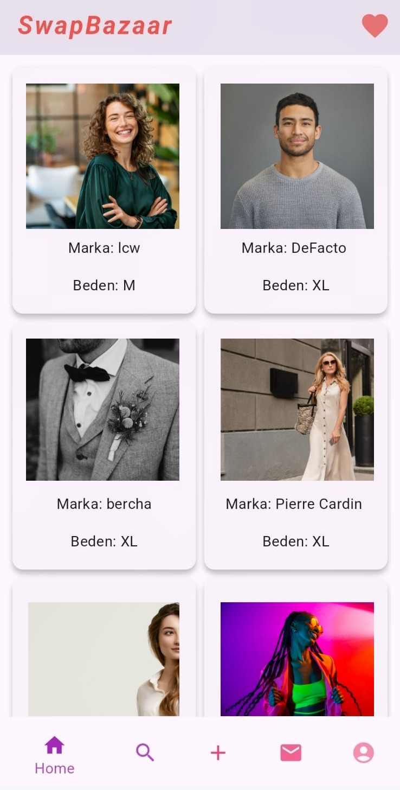
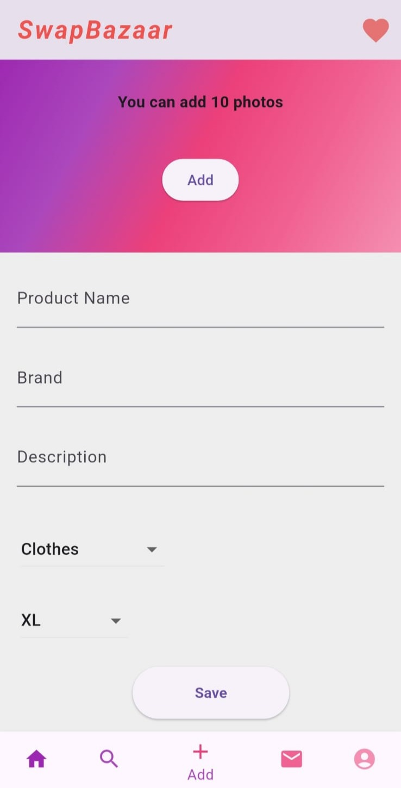
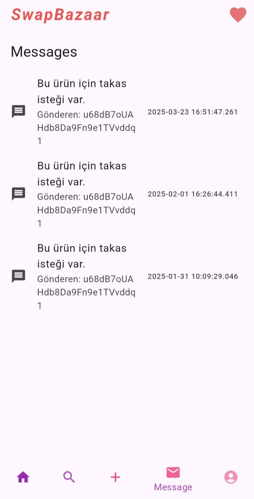
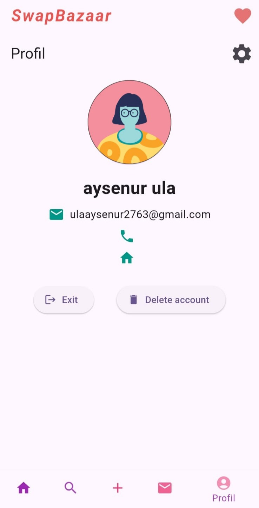
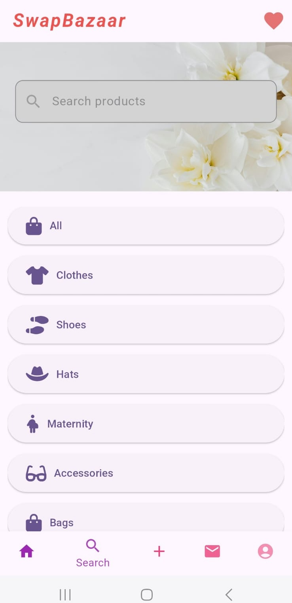
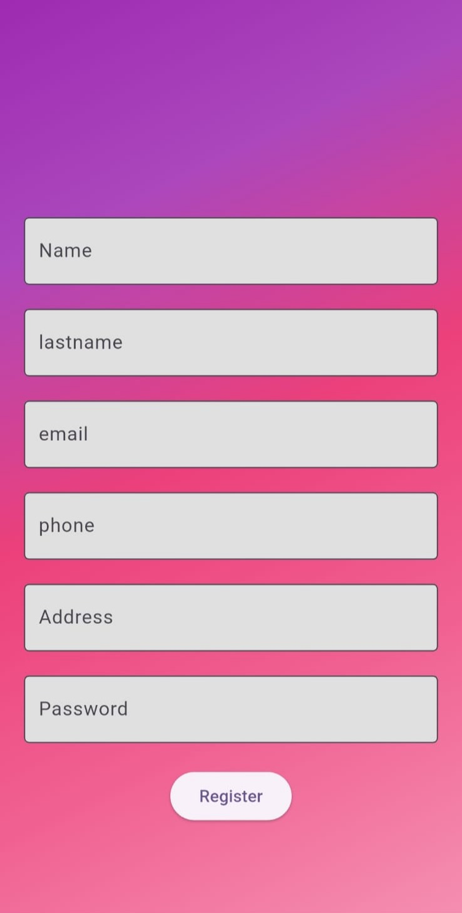
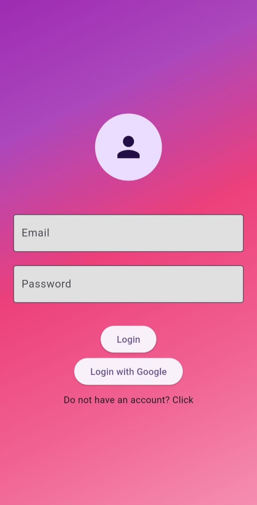

# Trendyol Dolap Uygulaması Benzeri Flutter Uygulaması

Bu proje, Trendyol'un Dolap uygulamasına benzer bir mobil uygulama geliştirmek için Flutter ve Firebase kullanılarak oluşturulmuştur. Uygulama, kullanıcıların ikinci el ürünleri alıp satmalarına olanak tanır. Kullanıcılar, ürünlerini listeleyebilir, diğer kullanıcıların ürünlerini görüntüleyebilir ve ürünler üzerinde işlem yapabilirler.

## Ekran Görüntüleri

| Ana Sayfa | Keşfet | Ürün Detay |
|----------|--------|------------|
|  |  |  |

| Profil | Arama | Kayıt | Giriş |
|--------|-------|-------|-------|
|  |  |  |  |

## Özellikler

- **Kullanıcı Kaydı ve Girişi**: Firebase Authentication kullanarak kullanıcıların kaydolmasını ve giriş yapmasını sağlar.
- **Ürün Listeleme**: Kullanıcılar, ürünlerini fotoğraflar, başlık, açıklama ve fiyat bilgileri ile listeleyebilir.
- **Ürün Görüntüleme**: Kullanıcılar, diğer kullanıcıların listelediği ürünleri görüntüleyebilir.
- **Ürün Güncelleme ve Silme**: Kullanıcılar, kendi listeledikleri ürünleri güncelleyebilir veya silebilir.
- **Firebase Firestore**: Ürün verileri, Firebase Firestore kullanılarak depolanır ve yönetilir.
- **Provider**: Durum yönetimi için Provider paketi kullanılmıştır.

## Gereksinimler

- Flutter SDK
- Dart
- Firebase projesi (Firestore ve Authentication özellikleri etkinleştirilmiş)

## Kurulum

1. Bu projeyi klonlayın:
   ```bash
   git clone https://github.com/kullaniciadi/proje-adi.git
   cd proje-adi
